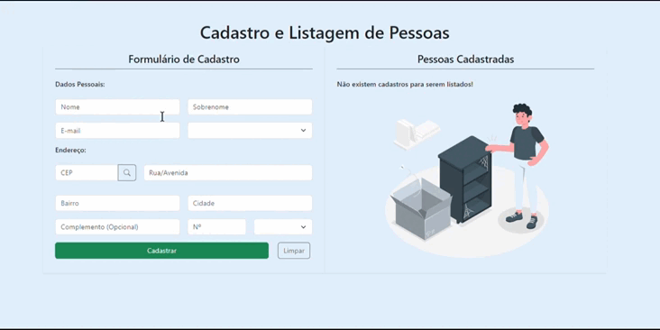

# CRUD de Pessoas

Teaser:



## Sobre

Aplicação utiliza de formulários reativos para cadastrar pessoas.
A listagem dinâmica permite visualização em tempo real das edições.

## Tecnologias Utilizadas

- Angular 17
- Typescript
- NodeJS
- Bootstrap
- Json-server

## Instalação

**Instalar Angular CLI:**

```shell
$ npm install -g @angular/cli
```
**Instalar dependências:**
```shell
$ npm install
```
**Execução do projeto:**
```shell
$ npm start
```
## Observações

- API e UI são executadas em paralelo no mesmo terminal, com o uso da ferramenta [Concurrently.](https://www.npmjs.com/package/concurrently)
- Pode-se alterar o arquivo db.json para quais dados desejar, desde que mantenha a estrutura do objeto.
- Aplicação criada em rotina de estudos do Angular, implementando novos recursos da versão 17.

Desenvolvido por Márkys Corrêa.
